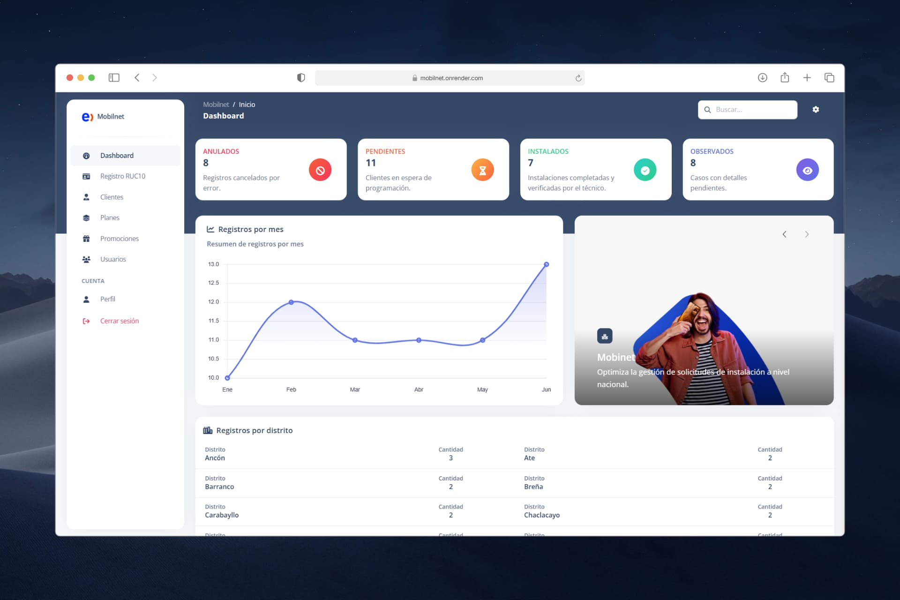

<div align="center">
  <a href="https://mobilnet.onrender.com">
    
  </a>
  <p></p>
</div>

<div align="center">


</div>

## 🚀 Main Features

- 👥 **Role-based access control** (BackOffice, Consultor, Supervisor, Administrador)
- 📝 **RUC10 registration** with validation rules
- 📄 **Automatic contract generation** (PDF export)
- 📊 **Dashboard with charts** for activity monitoring
- 📑 **Reports generation** (using JasperReports)
- 💻 **Responsive interface** with Bootstrap
- 🔍 Search, filter, and export options for data tables

## 🛠 Tech Stack

- **Backend:** Spring Boot `3.5.0` (Java 17)
- **Frontend:** Thymeleaf + HTML, CSS, Bootstrap, JavaScript
- **Database:** MySQL
- **Reporting:** JasperReports `6.20.0`, jsPDF + AutoTable
- **ORM:** Spring Data JPA (Hibernate)
- **Tools & Utilities:** Lombok, Maven

## 🔧 Installation & Setup

Follow these steps to run **Mobilnet** locally:

1. **Clone the repository**
   ```bash
   git clone https://github.com/jaycodev/mobilnet.git
   cd mobilnet
   ```

2. **Configure local properties**
   
   Create a file named `application-local.properties` inside `src/main/resources/` with your local database credentials:
   ```properties
   spring.datasource.url=jdbc:mysql://localhost:3306/mobilnet_db?useSSL=false&serverTimeZone=UTC&allowPublicKeyRetrieval=true
   spring.datasource.username=your_username
   spring.datasource.password=your_password
   spring.jpa.hibernate.ddl-auto=validate
   ```

   > ⚠️ **Do not commit** your credentials — this file should be ignored in `.gitignore`.

3. **Set up the database**
   
   In the `/database/` folder, run the script `schema.sql` (and optional seed data) to create and initialize the database.

4. **Run the project**
   ```bash
   mvn spring-boot:run
   ```
   Or build and run:
   ```bash
   mvn clean package
   java -jar target/mobilnet-1.0.0.war
   ```

5. **Access the application**
   ```
   http://localhost:8080
   ```

## 🧑‍💻 Contributors

<a href="https://github.com/jaycodev/mobilnet/graphs/contributors">
  
</a>

## 📄 License

This project is licensed under the [MIT License](./LICENSE).
